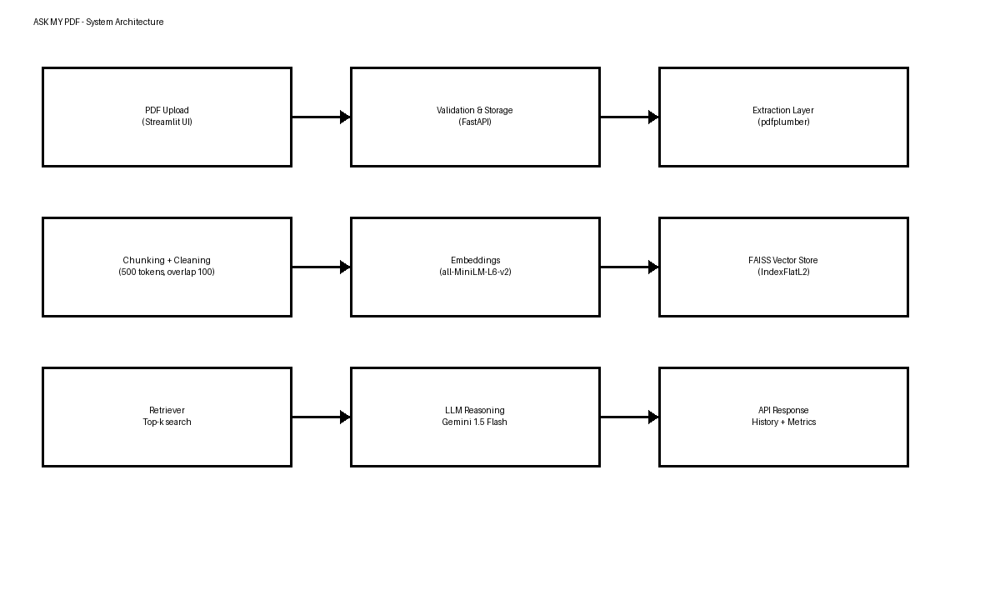

# ASK MY PDF – AI PDF Assistant

A production-ready Retrieval-Augmented Generation (RAG) system that enables natural language conversations with PDF documents. Built with FastAPI backend, Flask frontend, and powered by LangChain, FAISS vector search, and multiple LLM providers.



## 🌟 Highlights

- **🔍 Multi-layer PDF Extraction:** Robust parsing with automatic fallback chain (pdfplumber → PyPDF → PyMuPDF) for maximum text extraction reliability
- **🧠 Advanced RAG Pipeline:** LangChain-powered chunking, local HuggingFace embeddings, and FAISS vector search with persistent storage
- **🔌 Flexible LLM Support:** Plug-and-play support for OpenAI GPT, Google Gemini, and Hugging Face models via unified API
- **💬 Conversation-Aware:** Maintains conversation context for multi-turn dialogues with intelligent chat history management
- **📊 Real-time Metrics:** Live performance tracking (latency, retrieval accuracy, chunk relevance) displayed in UI
- **🎨 Modern UI/UX:** Responsive Flask web interface with drag-and-drop upload, PDF preview, session management, and chat history
- **🔒 Security-First:** Input validation, file sanitization, size limits, STRIDE threat modeling, and secure API key management
- **📈 Production Ready:** Complete logging, error handling, session persistence, and comprehensive documentation

## 📁 Repository Structure

```
ASK-MY-PDF/
├── backend/                    # FastAPI backend services
│   ├── main.py                # Main FastAPI app with all endpoints
│   ├── extract.py             # Multi-layer PDF extraction engine
│   ├── rag.py                 # RAG pipeline (chunking, embeddings, FAISS)
│   └── __pycache__/           # Python bytecode cache
├── frontend/                   # Flask web application
│   ├── app.py                 # Flask server with session management
│   ├── templates/             # Jinja2 HTML templates
│   │   ├── base.html          # Base template with layout
│   │   ├── landing.html       # Landing page
│   │   └── index.html         # Main chat interface
│   └── static/                # Static assets
│       ├── css/style.css      # Custom styles and animations
│       └── js/app.js          # Frontend logic and API client
├── data/                       # Runtime data storage
│   └── uploaded_files/        # Secure PDF upload directory
├── models/                     # Persistent model storage
│   ├── langchain_index/       # FAISS vector database (auto-created)
│   ├── documents_meta.json    # Document registry and metadata
│   └── embeddings_meta.json   # Legacy metadata (optional)
├── docs/                       # Project documentation
│   ├── appendix.md            # Product backlog, sprint details
│   ├── architecture.png       # System architecture diagram
│   ├── threat_model.pdf       # STRIDE security analysis
│   └── sprint_plan.pdf        # Agile sprint planning
├── scripts/                    # Utility scripts
│   └── generate_docs.py       # Documentation generator
├── test_client.py             # API testing utility
├── requirements.txt           # Python dependencies
├── README.md                  # This file
├── ARCHITECTURE.md            # Technical architecture details
├── SPRINT_TRACKING.md         # Development sprint tracking
└── TROUBLESHOOTING.md         # Common issues and solutions
```

## 🚀 Quick Start

### Prerequisites
- Python 3.8 or higher
- pip package manager
- At least one LLM API key (OpenAI, Google Gemini, or Hugging Face)

### Installation

1. **Clone the repository**
   ```bash
   git clone https://github.com/anargh-t/ASK-MY-PDF.git
   cd ASK-MY-PDF
   ```

2. **Create and activate virtual environment**
   ```bash
   # Windows
   python -m venv .venv
   .venv\Scripts\activate
   
   # Linux/Mac
   python -m venv .venv
   source .venv/bin/activate
   ```

3. **Install dependencies**
   ```bash
   pip install --upgrade pip
   pip install -r requirements.txt
   ```

4. **Configure environment variables**
   
   Create a `.env` file in the root directory:
   
   ```env
   # === LLM Provider Configuration (Choose ONE) ===
   
   # Option 1: OpenAI (Recommended for production)
   LLM_PROVIDER=openai
   OPENAI_API_KEY=sk-your-openai-api-key-here
   OPENAI_MODEL=gpt-4o-mini
   
   # Option 2: Google Gemini (Cost-effective)
   # LLM_PROVIDER=gemini
   # GOOGLE_API_KEY=your-gemini-api-key-here
   # GEMINI_MODEL=gemini-1.5-flash
   
   # Option 3: Hugging Face (Open source models)
   # LLM_PROVIDER=huggingface
   # HUGGINGFACEHUB_API_TOKEN=your-hf-token-here
   # HUGGINGFACE_MODEL=meta-llama/Meta-Llama-3-8B-Instruct
   # HUGGINGFACE_API_BASE=https://router.huggingface.co/v1
   
   # === Embedding Configuration (Local - No API Key Required) ===
   EMBEDDING_MODEL=sentence-transformers/all-MiniLM-L6-v2
   
   # === Optional Configuration ===
   LLM_MAX_TOKENS=512
   DEFAULT_CHUNK_SIZE=500
   DEFAULT_OVERLAP=100
   
   # === Flask Configuration ===
   SECRET_KEY=your-secret-key-for-flask-sessions
   FLASK_DEBUG=False
   PORT=5000
   BACKEND_URL=http://localhost:8000
   ```

5. **Start the backend server** (Terminal 1)
   ```bash
   uvicorn backend.main:app --reload --port 8000
   ```
   
   Backend will be available at `http://localhost:8000`
   - API documentation: `http://localhost:8000/docs`

6. **Start the frontend server** (Terminal 2)
   ```bash
   cd frontend
   python app.py
   ```
   
   Frontend will be available at `http://localhost:5000`

7. **Access the application**
   
   Open your browser and navigate to `http://localhost:5000`

## 📖 Usage Guide

### Using the Web Interface

1. **Upload a PDF**
   - Click the upload area or drag and drop a PDF file (max 20MB)
   - Wait for the upload confirmation

2. **Extract and Index**
   - Adjust chunk size (200-1500 characters) and overlap (50-400 characters) if needed
   - Click "Extract & Index" to process the document
   - Wait for indexing to complete (shows number of chunks created)

3. **Ask Questions**
   - Type your question in the chat input
   - View the AI's response with reference chunks
   - See real-time metrics (latency, retrieval accuracy)

4. **Manage Sessions**
   - Clear chat to start fresh with the same document
   - Create new session to upload a different document
   - Access previous sessions from the history sidebar

### API Reference

#### 1. Health Check
```http
GET /
```
**Response:**
```json
{
  "status": "healthy",
  "documents": 5,
  "history": 23
}
```

#### 2. Upload PDF
```http
POST /upload
Content-Type: multipart/form-data
```
**Parameters:**
- `file`: PDF file (max 20MB)

**Response:**
```json
{
  "doc_id": "uuid-string",
  "filename": "document.pdf",
  "size_mb": 2.5,
  "uploaded_at": "2025-11-25T10:30:00"
}
```

#### 3. Extract and Index Text
```http
POST /extract-text
Content-Type: application/json
```
**Request Body:**
```json
{
  "doc_id": "uuid-string",
  "chunk_size": 500,
  "overlap": 100
}
```

**Response:**
```json
{
  "doc_id": "uuid-string",
  "filename": "document.pdf",
  "text_preview": "First 500 characters...",
  "tables_detected": 3,
  "chunks_indexed": 45,
  "processed_at": "2025-11-25T10:31:15"
}
```

#### 4. Query Document
```http
POST /query
Content-Type: application/json
```
**Request Body:**
```json
{
  "doc_id": "uuid-string",
  "question": "What are the key findings?",
  "top_k": 5,
  "relevance_score": 0.85,
  "conversation_history": [
    {"role": "user", "content": "Previous question?"},
    {"role": "assistant", "content": "Previous answer."}
  ]
}
```

**Response:**
```json
{
  "answer": "Based on the document, the key findings are...",
  "relevant_chunks": [
    "Chunk 1 text preview (200 chars)...",
    "Chunk 2 text preview (200 chars)..."
  ],
  "references": [
    {"page": 5, "text": "Reference snippet..."},
    {"page": 7, "text": "Another reference..."}
  ],
  "metrics": {
    "latency_ms": 1250.5,
    "retrieved": 5,
    "retrieval_accuracy": 0.92,
    "relevance_score": 0.85
  },
  "timestamp": "2025-11-25T10:32:00"
}
```

#### 5. Get Query History
```http
GET /history
```
**Response:**
```json
{
  "history": [
    {
      "doc_id": "uuid-string",
      "question": "What are the conclusions?",
      "answer": "The main conclusions are...",
      "chunks_returned": 5,
      "metrics": {
        "latency_ms": 980.2,
        "retrieved": 5,
        "retrieval_accuracy": 0.88,
        "relevance_score": null
      }
    }
  ]
}
```

### Command-Line Examples

**Windows PowerShell:**
```powershell
# Upload a PDF
curl.exe -F "file=@sample.pdf" http://localhost:8000/upload

# Extract and index
curl.exe -X POST http://localhost:8000/extract-text `
  -H "Content-Type: application/json" `
  --data '{"doc_id":"<uuid>","chunk_size":600,"overlap":120}'

# Query the document
curl.exe -X POST http://localhost:8000/query `
  -H "Content-Type: application/json" `
  --data '{"doc_id":"<uuid>","question":"Summarize the key points","top_k":5}'
```

**Linux/Mac:**
```bash
# Upload a PDF
curl -F "file=@sample.pdf" http://localhost:8000/upload

# Extract and index
curl -X POST http://localhost:8000/extract-text \
  -H "Content-Type: application/json" \
  -d '{"doc_id":"<uuid>","chunk_size":600,"overlap":120}'

# Query the document
curl -X POST http://localhost:8000/query \
  -H "Content-Type: application/json" \
  -d '{"doc_id":"<uuid>","question":"Summarize the key points","top_k":5}'
```

## 📊 Features in Detail

### RAG Pipeline Architecture

1. **Multi-layer PDF Extraction**
   - Primary: `pdfplumber` for text and tables
   - Fallback 1: `PyPDF` for standard text extraction
   - Fallback 2: `PyMuPDF` for complex layouts
   - Page markers preserved for accurate citations

2. **Intelligent Text Chunking**
   - LangChain `RecursiveCharacterTextSplitter`
   - Configurable chunk size (200-1500 characters)
   - Overlap control for context preservation
   - Page number tracking for each chunk

3. **Local Embedding Generation**
   - HuggingFace `sentence-transformers` models
   - Default: `all-MiniLM-L6-v2` (384 dimensions)
   - Runs locally - no API calls required
   - First-time download ~90MB, then cached

4. **FAISS Vector Search**
   - Local persistent index storage
   - Similarity search with L2 distance
   - Document-level filtering
   - Auto-save after each indexing operation

5. **Conversational Context**
   - Maintains last 10 messages for context
   - Dynamic prompt construction
   - Multi-turn dialogue support
   - Session-based conversation management

### Performance Metrics

- **Latency (ms):** End-to-end query processing time including retrieval and LLM inference
- **Retrieval Accuracy:** Proportion of relevant chunks (FAISS distance score ≤ 1.0)
- **Chunks Retrieved:** Number of document chunks used for answer generation
- **Relevance Score:** Optional manual feedback rating (0.0 - 1.0)

### Security Features

- **File Validation:** Extension, MIME type, and size checks
- **Filename Sanitization:** Removes dangerous characters and path traversal attempts
- **Text Sanitization:** Strips control characters and malicious payloads
- **API Key Management:** Environment-based secrets, never exposed to frontend
- **Size Limits:** 20MB maximum file size to prevent DoS
- **Error Handling:** Comprehensive exception handling with safe error messages
- **STRIDE Analysis:** Complete threat model documentation in `docs/`

## 🔧 Configuration Options

### LLM Provider Settings

| Provider | Model Options | Best For |
|----------|--------------|----------|
| **OpenAI** | `gpt-4o-mini`, `gpt-4`, `gpt-3.5-turbo` | Production use, highest quality |
| **Gemini** | `gemini-1.5-flash`, `gemini-1.5-pro` | Cost-effective, good performance |
| **Hugging Face** | `meta-llama/Meta-Llama-3-8B-Instruct`, `google/gemma-2-9b-it` | Open source, privacy-focused |

### Embedding Model Options

| Model | Dimensions | Size | Best For |
|-------|-----------|------|----------|
| `all-MiniLM-L6-v2` | 384 | ~90MB | Default, balanced |
| `all-mpnet-base-v2` | 768 | ~420MB | Higher quality |
| `paraphrase-multilingual-MiniLM-L12-v2` | 384 | ~420MB | Multi-language |

### Chunking Parameters

- **Chunk Size:** Controls the length of text segments
  - Small (200-400): Better for precise questions, more chunks
  - Medium (500-800): Balanced performance (default: 500)
  - Large (900-1500): Better for summarization, fewer chunks

- **Overlap:** Preserves context between chunks
  - Recommended: 20% of chunk size
  - Default: 100 characters for 500-char chunks

### Advanced Environment Variables

```env
# LLM Configuration
LLM_MAX_TOKENS=512              # Maximum response length
DEFAULT_CHUNK_SIZE=500          # Default text chunk size
DEFAULT_OVERLAP=100             # Default chunk overlap

# Backend Configuration
BACKEND_URL=http://localhost:8000   # Backend API URL

# Flask Configuration
SECRET_KEY=your-secret-key      # Session encryption key
FLASK_DEBUG=False               # Enable debug mode
PORT=5000                       # Frontend port
```

## 🧪 Testing

### Manual Testing via Web UI

1. Start both backend and frontend servers
2. Navigate to `http://localhost:5000`
3. Upload a sample PDF
4. Extract and index the document
5. Ask test questions and verify responses

### API Testing with curl

Use the provided examples in the API Reference section, or use the test client:

```bash
python test_client.py
```

### Testing with Different LLM Providers

1. Update `.env` with desired provider
2. Restart the backend server
3. Verify provider in backend logs: `LLM_PROVIDER: openai`

## 📚 Documentation

- **[ARCHITECTURE.md](ARCHITECTURE.md)** - Detailed technical architecture, data flow, and component descriptions
- **[TROUBLESHOOTING.md](TROUBLESHOOTING.md)** - Common issues and solutions
- **[SPRINT_TRACKING.md](SPRINT_TRACKING.md)** - Development progress and sprint retrospectives
- **[docs/appendix.md](docs/appendix.md)** - Product backlog, release plan, and burndown charts
- **docs/threat_model.pdf** - STRIDE security analysis
- **docs/sprint_plan.pdf** - Agile sprint planning documentation

## 🚦 Troubleshooting

### Common Issues

**Backend won't start:**
- Check Python version: `python --version` (requires 3.8+)
- Verify all dependencies installed: `pip install -r requirements.txt`
- Ensure no other process using port 8000

**"Cannot connect to backend" error:**
- Verify backend is running on port 8000
- Check `BACKEND_URL` in `.env` matches backend address
- Test backend health: `curl http://localhost:8000/`

**"Missing API key" error:**
- Verify `.env` file exists in root directory
- Check API key for selected `LLM_PROVIDER` is set
- Restart backend after changing `.env`

**Slow query responses:**
- Check LLM provider status (may have rate limits)
- Reduce `top_k` parameter (fewer chunks = faster)
- Consider reducing `LLM_MAX_TOKENS`

**PDF extraction fails:**
- Verify PDF is not password-protected
- Check PDF is not corrupted
- Ensure PDF contains machine-readable text (not just images)

For more issues and solutions, see [TROUBLESHOOTING.md](TROUBLESHOOTING.md)

## 🗺️ Roadmap

### Version 1.1 (Planned)
- [ ] Multi-document library support
- [ ] Enhanced semantic reranking
- [ ] Citation highlighting in PDF viewer
- [ ] Export conversation history

### Version 2.0 (Future)
- [ ] User authentication and multi-user support
- [ ] Persistent database for document storage
- [ ] Advanced analytics dashboard
- [ ] Multi-language support with translation
- [ ] Cloud deployment templates (AWS, GCP, Azure)
- [ ] Docker containerization
- [ ] REST API client libraries (Python, JavaScript)

### Research Ideas
- Fine-tuned embeddings for domain-specific documents
- Hybrid search (dense + sparse retrieval)
- Question classification and routing
- Automatic chunk size optimization

## 🤝 Contributing

Contributions are welcome! Please feel free to submit a Pull Request. For major changes:

1. Fork the repository
2. Create your feature branch (`git checkout -b feature/AmazingFeature`)
3. Commit your changes (`git commit -m 'Add some AmazingFeature'`)
4. Push to the branch (`git push origin feature/AmazingFeature`)
5. Open a Pull Request

### Development Guidelines

- Follow PEP 8 style guide for Python code
- Add docstrings to all functions and classes
- Update documentation for new features
- Test changes with multiple PDF types
- Ensure backward compatibility

## 📄 License

This project is licensed under the MIT License - see the LICENSE file for details.

## 🙏 Acknowledgments

- **LangChain** - RAG framework and LLM integration
- **FAISS** - Efficient similarity search
- **HuggingFace** - Sentence transformers and model hosting
- **FastAPI** - Modern API framework
- **Flask** - Web application framework

## 📧 Contact

- GitHub: [@anargh-t](https://github.com/anargh-t)
- Repository: [ASK-MY-PDF](https://github.com/anargh-t/ASK-MY-PDF)

---

**Built with ❤️ using Python, FastAPI, Flask, and LangChain**

